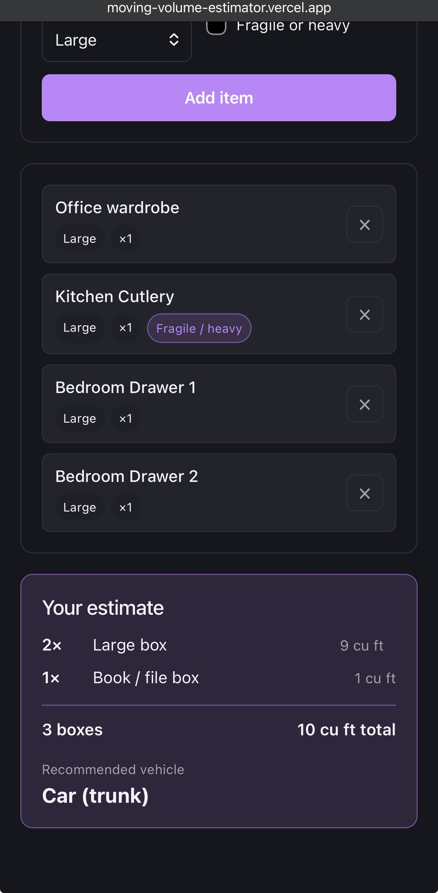

# 📦 Moving Volume Estimator

A small web app that helps someone planning a move figure out **(1) how many
boxes they'll need** and **(2) what vehicle or truck will fit it all**.

**▶️ Live app: <https://moving-volume-estimator.vercel.app/>**



## Usage

1. **(Optional) Scan a photo.** Tap **Take or upload a photo** — on a phone this
   opens the camera; on desktop it's a file picker. Hit **Detect items** and the
   app auto-fills your list with what it recognizes, each pre-tagged with a rough
   size you can edit. (Skip this and add everything by hand if you prefer.)
2. **Add your items.** For each thing you're moving, type a name (optional),
   pick a **size** (small / medium / large), set the **quantity** (e.g. 8 books),
   and tick **Fragile or heavy** if it needs a sturdier box. Tap **Add item**.
3. **Build your list.** Each item — detected or manual — appears below the form
   with its size, quantity, and a fragile/heavy tag. Remove any with the **✕**
   button.
4. **Read your estimate.** The summary updates live as you edit the list:
   - how many **boxes of each type** (and the volume each adds),
   - the **total box count** and **total volume** in cubic feet, and
   - the **recommended vehicle** — from a car trunk up to a 26' moving truck —
     with a heads-up when the load will likely take **more than one trip**.

No sign-up and no backend — everything runs in your browser for the session.

## How the estimate works

- **Quantity** — one item can stand for many (`8 books`), so you don't add
  eight rows.
- **Fragile / heavy rule** — beyond raw volume, anything tagged fragile or heavy
  is routed into the small, sturdy **book/file box** (so a heavy box stays
  liftable and a fragile one is better protected), instead of the larger box its
  size alone would pick.
- **Real box & vehicle sizes** — box volumes use U-Haul's published dimensions
  (book box 1.0 → extra-large 6.0 cu ft); vehicle capacities use real published
  cargo volumes (cargo van 245, 10' 402, 15' 764, 20' 1,016, 26' 1,682 cu ft,
  plus a typical car trunk and SUV). The per-box packing capacities are
  deliberate MVP assumptions, not a precise logistics model.

## The flow

> **add items (scan a photo _or_ type them) → box estimate → vehicle suggestion**

Everything runs in the browser. There is **no backend, database, or account** —
all state is held in memory for the session.

## Photo scanning

Instead of typing every item, you can **scan a photo** of a room: the app detects
belongings and fills the list with a coarse small/medium/large guess per item,
which you then confirm or edit. A single photo has no scale reference, so this is
deliberately _"detect items, you confirm sizes"_ — not automatic precision.

Detection sits behind one interface — `detectItems(image) → { name, size }[]` in
`src/lib/detect.js` — so the backend is swappable and emits the **same** item
shape manual entry produces (and therefore feeds the same `estimateBoxes()`
pipeline, unchanged):

- **COCO-SSD (default, no API key)** — TensorFlow.js runs
  [`@tensorflow-models/coco-ssd`](https://github.com/tensorflow/tfjs-models/tree/master/coco-ssd)
  fully in the browser; it loads lazily on the first detection. **Limitation:** it
  recognizes only a **fixed ~80 object classes** (`bottle`, `book`, `chair`, `tv`,
  `couch`…), so it genuinely *cannot* detect things outside that list — clothing,
  instruments (no "guitar" class), and most décor. Those it misses you add by
  hand; detection is a head start, not a complete inventory.
- **Gemini vision (optional, much broader coverage)** — recognizes essentially
  any object, so it's the upgrade for real household scanning. Used automatically
  when a `VITE_GEMINI_API_KEY` is set in a gitignored `.env.local` (with COCO as
  the fallback). It's asked for JSON only and parsed defensively.

  > ⚠️ **API-key limitation:** Vite inlines any `VITE_`-prefixed variable into the
  > client bundle, so the key is **visible on any deployed site**. That's fine for
  > local or personal-demo use, but for a public deploy you should proxy the call
  > through a minimal serverless function so the key stays server-side. The live
  > demo runs the no-key COCO path.

**Image formats:** detection decodes via `createImageBitmap`, so it works with
JPEG, PNG, and WebP. **HEIC** (the default iPhone photo format) **can't be decoded
in most browsers** — the app shows a clear message asking for a JPEG/PNG. Set the
iPhone camera to _Settings → Camera → Formats → Most Compatible_, or export as
JPEG.

Because detection and the estimator are decoupled this way, the estimation and
vehicle-lookup logic stays in plain, framework-free modules under `src/lib/` (no
React imports) — manual entry and the scanner are just two ways to build the same
list of sized items.

## Tech stack

- [Vite](https://vite.dev/) + [React](https://react.dev/) (JavaScript)
- [Vitest](https://vitest.dev/) for unit tests on the estimation + detection logic
- Photo detection via [TensorFlow.js COCO-SSD](https://github.com/tensorflow/tfjs-models/tree/master/coco-ssd)
  (default, in-browser) or Google Gemini vision (optional)
- Deployed on [Vercel](https://vercel.com/)
- No backend, no database, no auth — in-memory state only

## Getting started

```bash
npm install
npm run dev      # start the dev server
npm run build    # production build
npm test         # run unit tests
```

## Project structure

```
src/
  lib/
    boxes.js      # framework-free box catalog + estimateBoxes()
    vehicles.js   # framework-free vehicle catalog + recommendVehicle()
    detect.js     # detectItems(image) → {name,size}[] (COCO-SSD / Gemini)
    items.js      # shared item shape; detection → editable list items
  App.jsx         # UI: photo scan + manual entry, list, live estimate
```

## Out of scope

Pixel-accurate volume or depth estimation, bounding-box overlays, custom model
training, and a full backend (beyond an optional serverless key-proxy). State
stays in memory — no database, no user accounts. This is a focused MVP, not a
precise logistics engine.
